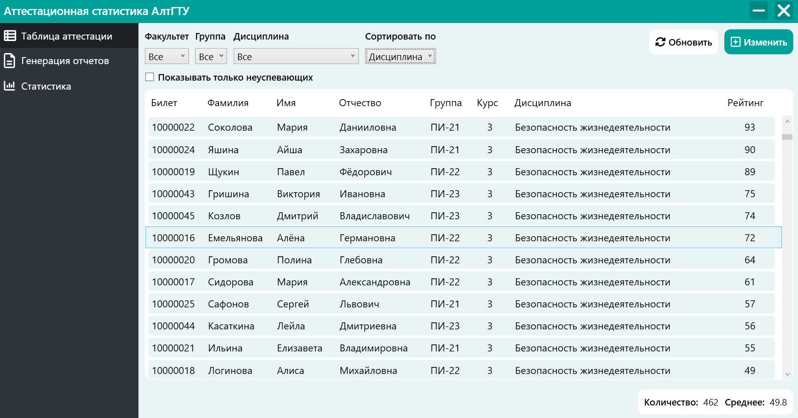
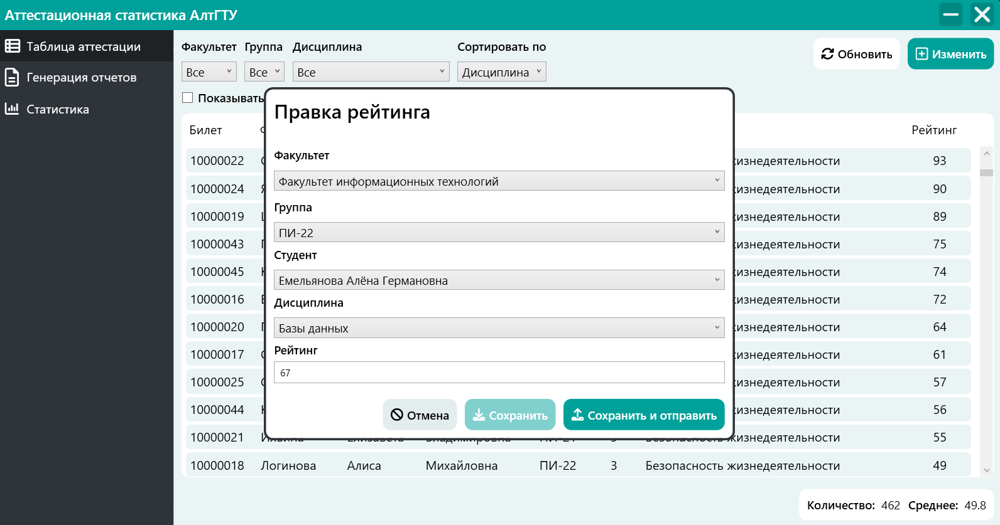
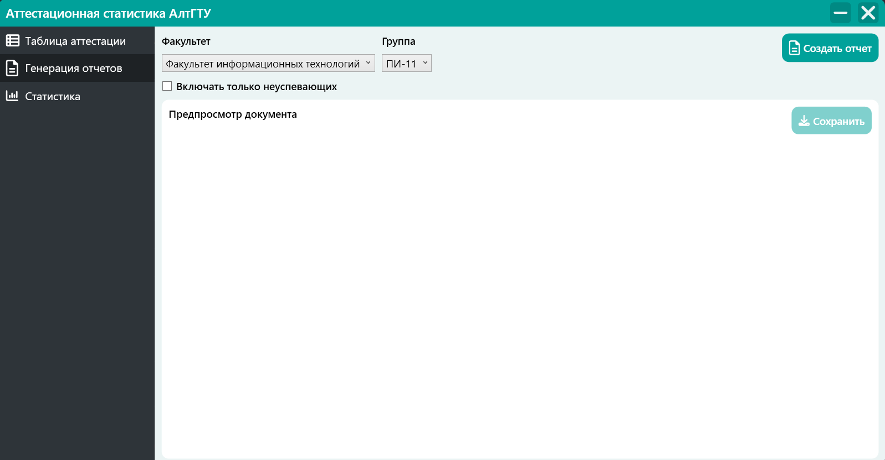
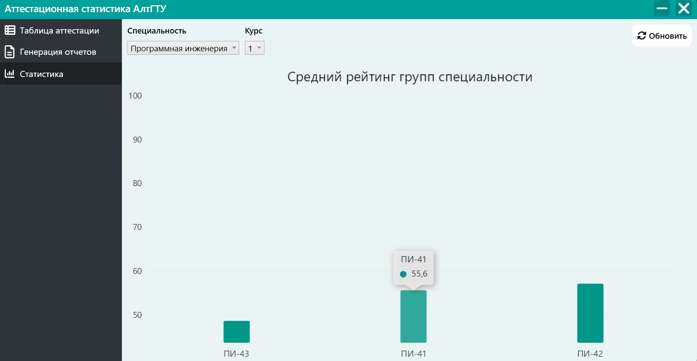
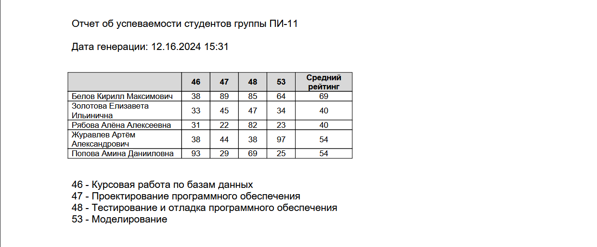

# Аттестационная статистика АлтГТУ
Программное средство разработано для обработки данных аттестации студентов 1-4 курсов.
  На данный моменты список задач выглядит следующим образом:
- [X] Создать форму добавления данных
- [X] Создать элемент управления для отображения данных в виде таблицы
- [X] Разработать метод автоматической подгрузки и изменения значений фильтров
- [X] Создать демонстративную страницу с инфографикой
- [ ] Добавить различные виды графиков
- [X] Разработать алгоритм формирования PDF документа
- [ ] Найти способ организовать предпросмотр отчёта в окне программы
 # Установка
 Программное средство разработано на платформе .NET для устройств под управления ОС Windows.
   **Перед началом работы необходимо**:
 - Скачать последнюю версию из раздела "Релизы"
 - Распаковать содержимое архива в необходимую директорию
## Внимание!
 Убедитесь, что все файлы dll из архива лежат в одном месте с исполняемым файлом, в противном случае функционал программного средства будет недоступен.
 # Скриншоты
 <kbd>
  
 </kbd>
 <kbd>
  
 </kbd>
  <kbd>
  
 </kbd>
  <kbd>
  
 </kbd>
  <kbd>
  
 </kbd>
